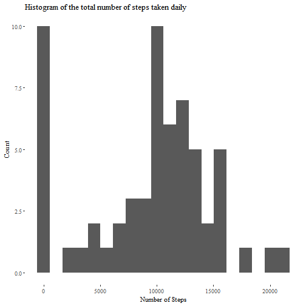
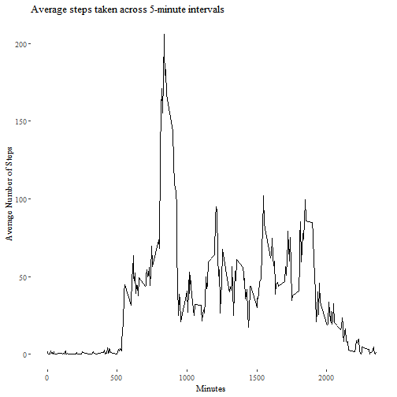
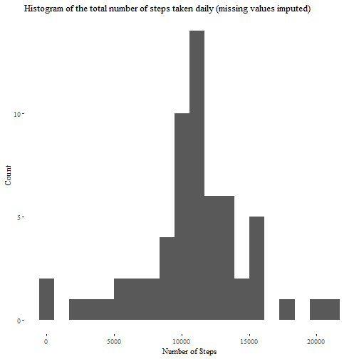
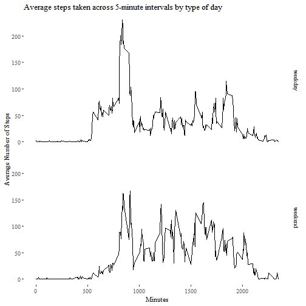

## Loading and preprocessing the data

```r
knitr::opts_chunk$set(echo = TRUE)

# Load necessary packages
library(ggthemes)
library(tidyverse)

# Code for reading in the dataset and/or processing the data

if(!file.exists("activity.csv")){
        unzip("activity.zip")}

activity <- read.csv("activity.csv")

activity$date <- as.Date(activity$date)
```


## What is mean total number of steps taken per day?

```r
# Calculate the totla number of steps taken per day
dailySteps <- activity %>%
        group_by(date) %>%
        summarise(totalSteps = sum(steps, na.rm = TRUE)) # ignore missing values

# Make a histogram of the total number of steps taken each day.
ggplot(dailySteps, aes(x = totalSteps)) +
        geom_histogram(bins = 20) +
        labs(title = "Histogram of the total number of steps taken daily",
             x = "Number of Steps",
             y = "Count") +
        theme_tufte()
```



```r
# Calculate and report the mean and median of the total number of steps taken per day.
meanDailySteps <- mean(dailySteps$totalSteps)
medianDailySteps <- median(dailySteps$totalSteps)
```

The mean number of steps taken daily is 9354.

The median number of steps taken daily is 10395.


## What is the average daily activity pattern?

```r
# Make a time series plot (i.e. type = "l") of the 5-minute interval (x-axis) 
# and the average number of steps taken, averaged across all days (y-axis)
intervalAverageSteps <- activity %>%
        group_by(interval) %>%
        summarise(averageSteps = mean(steps, na.rm = TRUE))

ggplot(intervalAverageSteps, aes(x = interval, y = averageSteps)) +
        geom_line() +
        labs(title = "Average steps taken across 5-minute intervals",
             x = "Minutes",
             y = "Average Number of Steps") + 
        theme_tufte()
```



```r
# Which 5-minute interval, on average across all the days in the dataset, 
# contains the maximum number of steps?
intervalMaxSteps <- with(intervalAverageSteps, 
                         interval[averageSteps == max(averageSteps)])
```

Time interval number 835 contains the maximum number of steps, on average.

## Imputing missing values

```r
# Calculate and report the total number of missing values in the dataset.
missingCount <- sum(!complete.cases(activity))
```

The dataset contains 2304 rows with missing data.


```r
# Strategy for imputing missing values: 
# replace NAs using the mean value for same interval across all days

# Create a new dataset that is equal to the original dataset but with the missing data filled in.
activityImputed <- activity %>%
        group_by(interval) %>%
        mutate(steps = ifelse(is.na(steps), mean(steps, na.rm = TRUE), steps))

imputedDailySteps <- activityImputed %>%
        group_by(date) %>%
        summarise(totalSteps = sum(steps))

# Make a histogram of the total number of steps taken each day.
ggplot(imputedDailySteps, aes(x = totalSteps)) +
        geom_histogram(bins = 20) +
        labs(title = "Histogram of the total number of steps taken daily (missing values imputed)",
             x = "Number of Steps",
             y = "Count") +
        theme_tufte()
```



```r
# Calculate and report the mean and median total number of steps taken per day.
meanImputedDailySteps <- mean(imputedDailySteps$totalSteps)
medianImputedDailySteps <- median(imputedDailySteps$totalSteps)

options(scipen = 999) # Turns off scientific notation format on displayed mean and median
```

By imputing the missing step counts, the mean daily step count increases from 9354 to 10766. The median value decreases from 10395 to 10766. With the imputed missing values, the mean and median step counts are equal. 

## Are there differences in activity patterns between weekdays and weekends?

```r
# Create a new factor variable in the dataset with two levels – “weekday” and “weekend”
# Make a panel plot of the 5-minute interval (x-axis) and the average number of steps taken, 
# averaged across all weekday days or weekend days (y-axis)
activityImputedDayType <- activityImputed %>%
        mutate(dayType = factor(ifelse(weekdays(date) %in% c("Saturday", "Sunday"), 
                                       "weekend", 
                                       "weekday"))) %>%
        group_by(dayType, interval) %>%
        summarise(averageSteps = mean(steps))

ggplot(activityImputedDayType, aes(x = interval, y = averageSteps)) +
        geom_line() +
        facet_grid(dayType~.) +
        labs(title = "Average steps taken across 5-minute intervals by type of day",
             x = "Minutes",
             y = "Average Number of Steps") + 
        theme_tufte()
```


